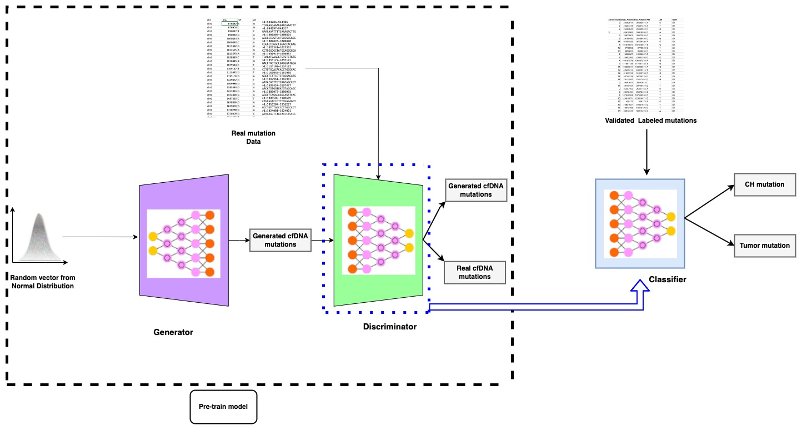

# Semi-supervised GAN (SSGAN) for cfDNA somatic mutation labeling

## Introduction
In the current research, we have developed a generative model-based tool for simulating the cfDNA SNVs and labeling each real cfDNA SNV as a tumor or CH. For this aim the real cfDNA NGS data which can be WGS, WES, and targeted sequencing will go under somatic variant calling with any proposed best practices, especially the one that is implemented by GATK and then the raw VCF files will be filtered based on the criteria that are explained in our manuscript. Next, the genomic coordination along with the nucleotide composition information will be extracted and used for training the GAN part of our model.
For the labeling part of our model, we have collected the validated tumor or CH-related variants from several databases and articles, and the same feature vector was prepared for each of them and fed to our semi-supervised part of our model.

## Repository Navigation Guide

### Script

•	SSGAN: A repository dedicated to training and validating SSGAN for somatic mutation labeling using both labeled and unlabeled data.

•	Preprocessing: Performs preprocessing on both labeled and unlabeled data. Unlabeled data in xlsx format of VCF files requires an additional preprocessing step compared to labeled data.

•	Train: The training function takes the model, data, and hyperparameters as input and trains the model. Two distinct functions for unsupervised and supervised training. GAN model trains on unlabeled data. Classifier trains on labeled data.

•	Model: Implements the SSGAN structure and essential functions in the .py file.

### Data
•	Unlabeled and labeled data serve as inputs for the model, both in xlsx format.
•	Each xlsx file corresponds to a .txt file containing approximately 20 upstream and downstream nucleotides.
### Glioma
•	Glioma data is used for validating the GAN as a pre-trained model.
### Example Classification
•	Demonstrates somatic mutation classification in VCF files using the classifier engine of SSGAN. This folder includes sample VCF, code, and label predictions.
### Example Generating
•	The generator for the GAN is trained on somatic mutations, enabling the generation of somatic mutations using this engine. This folder includes code and 1000 sample mutations generated.
### Model Weights
•	Generator, discriminator, GAN, and classifier models are saved in .keras format for further validations and usage.

## Somatic Mutation Classification

• Upload your chosen VCF dataset into the '/Example Classification/' folder in xlsx format. Additionally, upload the corresponding .txt file, which includes 20 upstream and downstream nucleotides. 

• Utilize the notebook '/Example Classification/Classification.ipynb' for labeling mutations.

## Generating Somatic Mutations

• Employ the notebook '/Example Generating/Generator.ipynb' for generating somatic mutations. 

• The output of the generator is a CSV file containing information on position, chromosome, alternative, and reference nucleotides.

## Installation

The SSGAN model is written in python3 and needs the below packages before running:\
numpy\
pandas\
tensorflow\
All the packages can be easily installed via terminal by:\
$ pip3 install "package name"

## Prepare input data

First, the raw NGS data should go under the somatic variant calling process based on GATK best practices as the workflow attached in .wdl file. Then, the VCF file obtained from cfDNA genomic data needs to be filtered based on the mentioned criteria in our article:

1)	SNV: variants had to meet the criterion of being only SNV for inclusion in the subsequent analysis and indels were not considered in this study.
2)	Human chromosomes: only variants associated with the 23 pairs of chromosomes and the mitochondrial genome were retained and other scaffolds in the reference genome were ignored.
3)	High depth: variants were further filtered to ensure they exhibited a high depth, with a depth exceeding 30.

The file in Excel is like:
	chr	pos	ref	alt	info	format	info2	
0	chr1	876887	A	G	DP=1;ECNT=2;MBQ=0	37;MFRL=0	60;MPOS=43;POPAF=7.30;TLOD=3.88	
1	chr1	876904	C	G	DP=1;ECNT=2;MBQ=0	38;MFRL=0	60;MPOS=60;POPAF=7.30;TLOD=3.98	
2	chr1	890027	T	C	DP=1;ECNT=2;MBQ=0	15;MFRL=0	60;MPOS=19;POPAF=7.30;TLOD=3.93	
3	chr1	890030	G	A	DP=1;ECNT=2;MBQ=0	28;MFRL=0	60;MPOS=16;POPAF=7.30;TLOD=3.93	
4	chr1	1000814	A	G	DP=1;ECNT=2;MBQ=0	38;MFRL=0	60;MPOS=54;POPAF=7.30;TLOD=3.98	
5	chr1	1000830	C	A	DP=1;ECNT=2;MBQ=0	38;MFRL=0	60;MPOS=38;POPAF=7.30;TLOD=3.98	
6	chr1	1015382	G	A	DP=1;ECNT=1;MBQ=0	38;MFRL=0	60;MPOS=21;POPAF=7.30;TLOD=3.98	
7	chr1	1023525	A	G	DP=1;ECNT=2;MBQ=0	38;MFRL=0	60;MPOS=52;POPAF=7.30;TLOD=3.98	
8	chr1	1023573	A	G	DP=1;ECNT=2;MBQ=0	38;MFRL=0	60;MPOS=24;POPAF=7.30;TLOD=3.98	
9	chr1	1038819	C	T	DP=1;ECNT=2;MBQ=0	34;MFRL=0	60;MPOS=40;POPAF=7.30;TLOD=3.58	
10	chr1	1038845	A	G	DP=1;ECNT=2;MBQ=0	33;MFRL=0	60;MPOS=14;POPAF=7.30;TLOD=3.48	
11	chr1	1039514	C	T	DP=1;ECNT=1;MBQ=0	38;MFRL=0	60;MPOS=10;POPAF=7.30;TLOD=3.98	
12	chr1	1109147	T	A	DP=1;ECNT=1;MBQ=0	31;MFRL=0	60;MPOS=49;POPAF=7.30;TLOD=3.28	
13	chr1	1123672	G	T	DP=2;ECNT=1;MBQ=38	38;MFRL=0	60;MPOS=59;POPAF=7.30;TLOD=3.50	
14	chr1	1195100	G	A	DP=1;ECNT=1;MBQ=0	38;MFRL=0	60;MPOS=27;POPAF=7.30;TLOD=3.98	
15	chr1	1249852	G	T	DP=1;ECNT=1;MBQ=0	38;MFRL=0	60;MPOS=38;POPAF=7.30;TLOD=3.98	
16	chr1	1309988	G	A	DP=1;ECNT=1;MBQ=0	38;MFRL=0	60;MPOS=45;POPAF=7.30;TLOD=3.98	
17	chr1	1385384	G	A	DP=1;ECNT=1;MBQ=0	38;MFRL=0	60;MPOS=42;POPAF=7.30;TLOD=3.98	
18	chr1	1452816	G	A	DP=1;ECNT=3;MBQ=0	16;MFRL=0	60;MPOS=29;POPAF=7.30;TLOD=4.20	
19	chr1	1452828	G	A	DP=1;ECNT=3;MBQ=0	15;MFRL=0	60;MPOS=41;POPAF=7.30;TLOD=4.20	
20	chr1	1487320	C	T	DP=1;ECNT=1;MBQ=0	38;MFRL=0	38;MPOS=32;POPAF=7.30;TLOD=3.98	
21	chr1	1658866	G	A	DP=3;ECNT=1;MBQ=36	38;MFRL=0	60;MPOS=17;POPAF=7.30;TLOD=3.20	
22	chr1	1659060	G	A	DP=1;ECNT=1;MBQ=0	37;MFRL=0	60;MPOS=47;POPAF=7.30;TLOD=3.88	
23	chr1	1720288	G	A	DP=1;ECNT=2;MBQ=0	38;MFRL=0	52;MPOS=47;POPAF=7.30;TLOD=4.20	
24	chr1	1720309	G	C	DP=1;ECNT=2;MBQ=0	38;MFRL=0	52;MPOS=56;POPAF=7.30;TLOD=4.20	
25	chr1	1841049	T	G	DP=1;ECNT=1;MBQ=0	38;MFRL=0	60;MPOS=34;POPAF=7.30;TLOD=3.98	
26	chr1	1841296	T	C	DP=1;ECNT=1;MBQ=0	38;MFRL=0	60;MPOS=32;POPAF=7.30;TLOD=3.98\
Then only the first four columns will be used in the model.\
Next, to extract the nucleotide composition around the SNV position GRCH38 and samtools are needed.\
$ sudo apt install samtools
$ 

